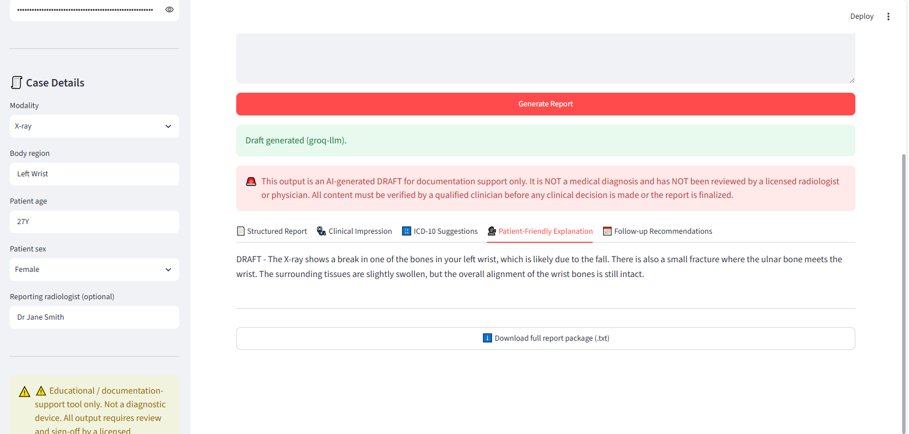
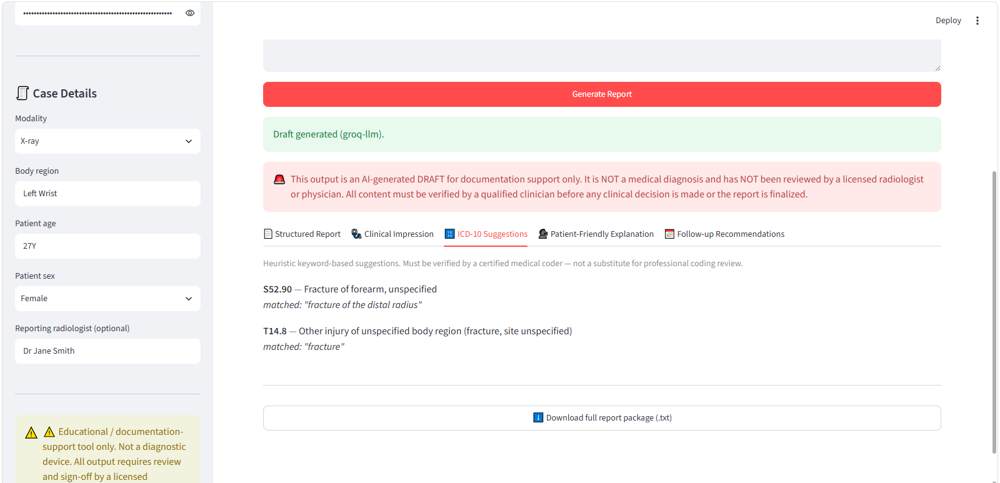
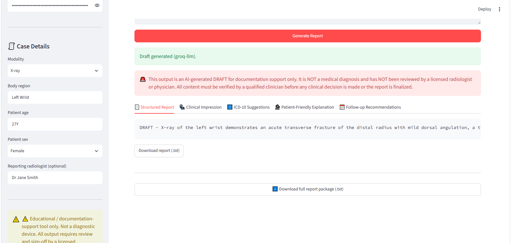
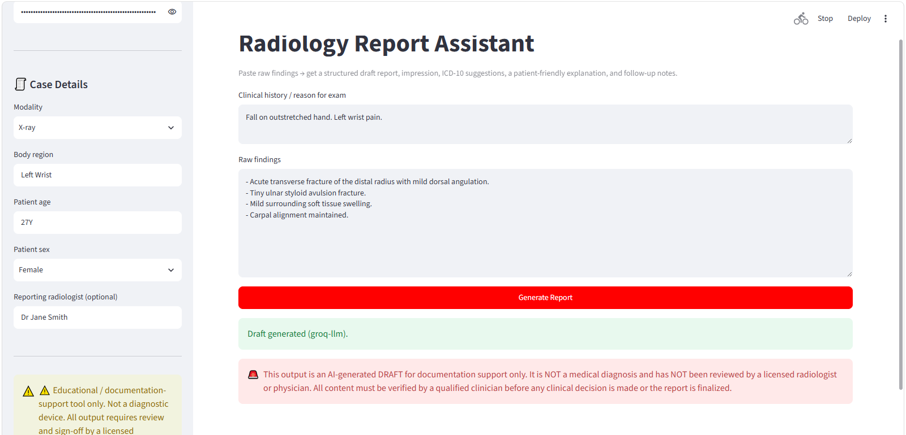
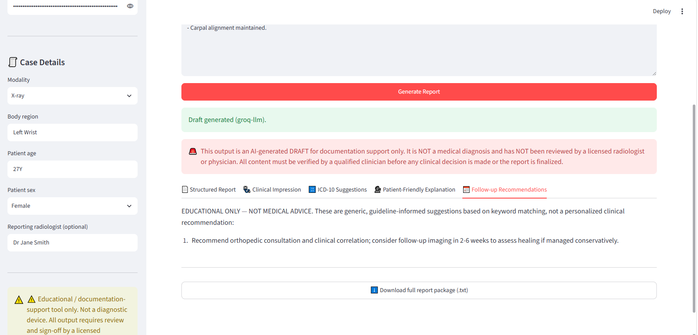

# Radiology Report Assistant

A documentation-support tool that turns raw X-ray/CT findings into:

- A structured radiology report (History / Technique / Findings / Impression)
- A concise clinical impression
- Heuristic ICD-10 code suggestions
- A plain-language, patient-friendly explanation
- Follow-up recommendations (clearly marked educational only)

## ⚠️ Important disclaimer

This is **not a diagnostic device** and does not practice medicine. It is a
drafting/documentation aid. Every output is generated either by deterministic
keyword rules or by an LLM, and **must be reviewed and signed off by a
licensed radiologist or physician** before any clinical, coding, or patient-
facing use. ICD-10 suggestions are heuristic keyword matches, not certified
medical coding. Follow-up recommendations are generic and educational — they
are not personalized medical advice.


---

---
---

---
---

---
---

---
---

---
## How it works

- **Offline / free mode (default):** a rule-based engine parses your pasted
  findings, splits them into lines, flags clinically significant terms,
  builds a numbered impression, matches findings against a curated ICD-10
  keyword table (`icd_mapping.py`), and generates a plain-language glossary
  explanation and follow-up notes from a rules table. No API key or internet
  access required at runtime beyond loading the app.
- **Optional LLM mode:** if you paste a free [Groq](https://console.groq.com)
  API key into the sidebar, the report/impression/patient-explanation text is
  redrafted by an LLM for smoother phrasing. ICD suggestions and follow-up
  recommendations still come from the deterministic rule engine so they stay
  auditable and don't rely on the model inventing codes. If the API call
  fails for any reason, it automatically falls back to the offline engine.

## Setup

```bash
pip install -r requirements.txt
streamlit run app.py
```

Then open the local URL Streamlit prints (usually `http://localhost:8501`).

## Project structure

```
radiology-assistant/
├── app.py             # Streamlit UI
├── report_engine.py   # Core report/impression/explanation/follow-up logic
├── icd_mapping.py      # Keyword -> ICD-10 lookup table
├── requirements.txt
└── README.md
```

## Extending it

- Add more findings/ICD-10 pairs to `ICD_RULES` in `icd_mapping.py`.
- Add more follow-up triggers to `FOLLOWUP_RULES` in `report_engine.py`.
- Add more plain-language terms to `PATIENT_FRIENDLY_GLOSSARY`.
- Swap the Groq call in `_call_groq()` for any OpenAI-compatible endpoint by
  changing the URL/model — the rest of the pipeline is provider-agnostic.
- Add PDF/DOCX export by piping `full_text` from `app.py` into `python-docx`
  or `reportlab` if you want a formatted file instead of plain text.
